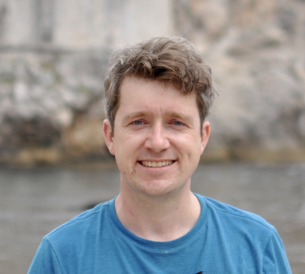

<!-- Main -->

<!-- Two -->
<section id="two" class="spotlights">

<section>

<header class="major">
<h3>Robert Davies</h3>
</header>

I am an associate professor in Statistical and Population Genomics at the Department of Statistics in the University of Oxford. I have diverse interests within statistical genetics but particularly enjoy research into challenging statistical problems applied to large datasets that will ultimately contribute to the potential to predict phenotype from genotype with a view towards eventual clinical application. Before starting in Oxford, I spent two years at the Hospital for Sick Children in Toronto as a postdoctoral fellow, and before that, worked for Genomics plc for a year and a half. I received my DPhil in the GMS program at Oxford, and have a Master's Degree in Mathematics and Statistics from the University of Ottawa. Each of these research and work experiences has been primarily in statistical genetics.

<ul class="actions">
<!-- <li><a href="https://davieslab.github.io" class="button">Your website</a></li> -->
</ul>

</section>

<section>

<header class="major">
<h3>Luis Torada Aguilella</h3>
</header>

I am a DPhil student in Robert’s group, co-supervised by Simon Myers at Oxford, as well as Satu Nahkuri and Tony Kam-Thong at Roche. I am currently investigating genetic heterogeneity within Autism Spectrum Disorder. Before coming to Oxford, I did a BSc in Biochemistry at University of Navarra (Spain) and a MSc in Bioinformatics and Systems Biology at Imperial College London (UK). I then joined the Systems Approaches to Biomedical Science Doctoral Training Center (SABS DTC) at the University of Oxford, starting my DPhil in Nov 2019. My current project reflects my major research interest: large-scale dataset modelling with health impact.

<ul class="actions">
<!-- <li><a href="https://davieslab.github.io" class="button">Your website</a></li> -->
</ul>

</section>

<section>

<header class="major">
<h3>Marcus Tutert</h3>
</header>

I am a 4th year DPhil student in Robert’s group, co-supervised by Gil McVean at Oxford (currently at Genomics plc). My research project involves the transferability of linkage disequilibrium, and other population genetic statistics, across diverse populations. This work is motivated in the context of GWAS studies to better analyse summary statistics. I have a honours bachelors degree from the University of Toronto in Math and Physics and started my DPhil in Oct 2017. Previous research experience includes  studying the immune system response to cancer at the Ontario Institute for Cancer Research, and investigating anti-malarial drug resistance markers in an African population at Toronto General Hospital. I enjoy learning about how human history shapes global genetic and phenotypic diversity, and the role these forces play in predisposing people to various complex disease risks and evolutionarily important traits. When not working, I can be found running, rowing, or cycling around Oxford.

<ul class="actions">
<!-- <li><a href="https://davieslab.github.io" class="button">Your website</a></li> -->
</ul>

</section>

